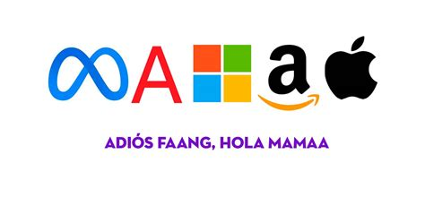
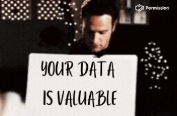

<!-- splash-page -->

# APIs

## The Who And The Why

---

## Questions We'll Ask

And answer!

- **What** is an API? (Briefly!)
- **Who** Builds Them?
- **Why** Make An API?

---

<!-- splash-page -->

# What Is An API?

---
## Let's Ask You

How would you define what an API is?

There's no wrong answer here, just inexact ones on the way to a more precise definition!

---

## Our Answers

- 

---

## These are good answers!

(I mean, _probably_. I wrote this slide days ago...)

The important things to note here are:

<!-- incremental-list -->
1. We've got some rough ideas.
2. I'll be asking you a _lot_ of questions like this during the course!
3. You _don't_ have to be an expert on APIs to give answering questions a try.
4. But we _will_ answer _every_ in-scope question we ask.

---

## A More Precise Definition

An API is:

<!-- incremental-list -->

- A **user** **interface** to an **app**. 🙋↔🖥
- By which the user and app exchange **data**. 🙋↔📈↔🖥
- And the **user** is a separate **app**. 🖥↔📈↔🖥

---

## An API "Exposes" Its Data

The API is a program, _usually_ on an HTTP server, that gives other apps access to its valuable data.

Users  of the API (or "consumers") can:

- Access the data.
- Change, update, or delete data (with permission!)

---

<!-- splash-page -->

## Who Offers APIs?

---

## Let's Ask You Folks

What companies have APIs?

- 

---

## Big Tech Does APIs

They must be doing something right...

---

## So Does Everyone Else

<!-- incremental-list -->

- PayPal
- Zillow
- eBay
- TicketMaster
- Yelp
- Spotify and Reddit
- Twilio and CapitalOne and Walmart
- MSNBC and eTrade and Etsy and Stripe and Uber and Expedia and FedEx and MSNBC and
- Basically everyone.

---
## Example APIs

Let's take a break and try accessing some!

Use your nearest or dearest tool (the browser, Postman, the terminal, Insomnia, VS Code, Emacs) to try these links:

- [Coindesk's BitCoin Price Index](https://api.coindesk.com/v1/bpi/currentprice.json)
- [The Weather In Miami](http://wttr.in/Miami?format=j1)
- [A partial list of ships in Star Wars](https://www.swapi.tech/api/starships)

Result you should see: a bunch of JSON data.

Note: here are the links for easy sharing from speaker view - Coindesk: https://api.coindesk.com/v1/bpi/currentprice.json - The Weather In Miami: http://wttr.in/Miami?format=j1 - A partial list of ships in Star Wars: https://www.swapi.tech/api/starships

---

<!-- splash-page -->

# Why Build APIs?

## Potential Benefits 

---

## Why Do Companies Share Their Valuable Data?

What do _you_ think?

- 

---

# Let's See Some Real-World Reasons!

Why would 

---

## Indirect Benefits

Giving away certain data can help build:

- A larger **partner** **ecosystem**. (eBay wants more sellers.)
- A **competitive** **advantage**. (The number of clients for tracking FedEx packages gives them a leg up.)
- Better **brand** **recognition**. (indeed wants you to think of them next time you look for a job.)
- More **agility** and **autonomy** of individual features. (Every single team at Amazon has its own API for other teams to access!)

As you can see, that's a LOT of potential indirect benefits.<!-- .element: class="fragment" -->

---

## Direct Revenue

If a company's data is in demand, it can simply sell that data as an additional revenue stream.

Twilio and The Weather Company use this model.

---

## This Is Why APIs Are BIG Business

<!-- incremental-list -->

Areas showing _massive_ growth in API development include:

- The **Healthcare** industry. (As you know!)
- The **Financial** sector.
- **Telecommunications** companies.

---

## So Now We Know The Who And Why

Time to really get started on the What.

---

<!-- ending-splash-page -->

# Let's Get Coding!
