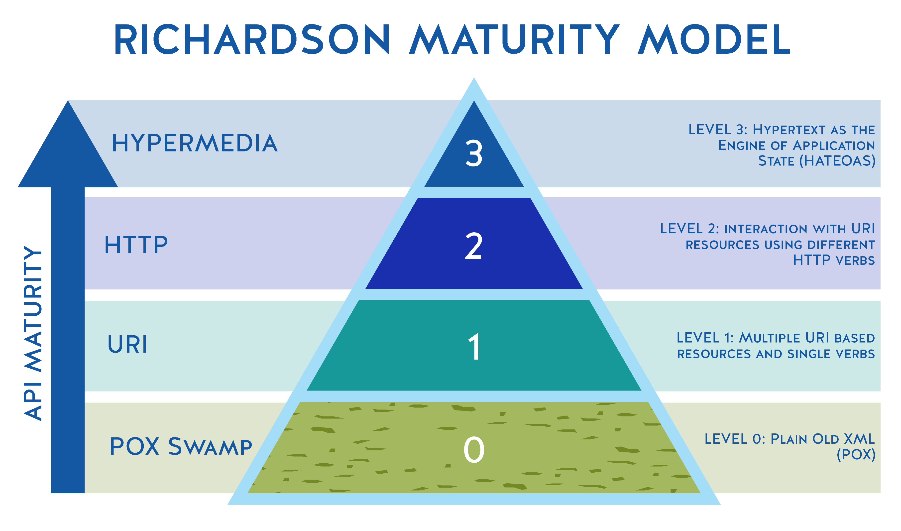

<!-- splash-page -->

# RESTfulness

## How Is It Measured?

---

## Questions We'll Ask

And answer!

- **What** Makes A RESTful API RESTful?
- **How** is it measured?
- **Why** do API developers and users care

---

<!-- splash-page -->

# What Is RESTfulness?

---

## RESTfulness Is:

How closely does an API match the specifications?

There are a few ways to measure this:

---

<!-- splash-page -->

# How Do We Measure RESTfulness?

---

## The Original Specifications

1. Client-Server Relationship
2. Uniform Interface 
3. Statelessness
4. Caching
5. Layered System
6. Code On Demand (optional)

---

## The Richardson Maturity Model

This measures the grammar of RESTful APIs.

- Level 0: none of the RESTful grammar requirements.
- Level 1: simple GET requests to well-defined resource URLs
- Level 2: Use of HTTP verbs like POST and DELETE
- Level 3: HATEOAS (Code On Demand)

---

<!-- splash-page -->

# Why Does RESTfulness Matter?

---

--- 

## Code On Demand

This optional architectural restraint encourages REST APIs to send links as data.

This restraint is outside our scope for this course, and most REST APIs don't provide it at all.

But Code on Demand is fascinating to read up on.

---

## What's Next

We're going to dive into making our API work  over HTTP using the Python library Flask.

---

<!-- ending-splash-page -->

# Let's Get Coding!
